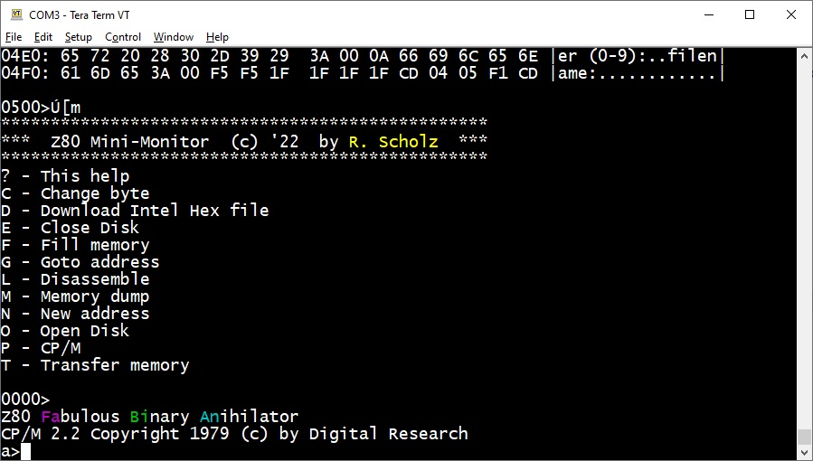

# Fa Bi An
FAbulous BInary ANihilator

A simple Z80 based CP/M system. I'll find here:

- KiCad files for the pcb
- 6-chip Z80 hardware
- 64KB static RAM
- 8/16/32KB (EP)ROM, here a 2764A version is used (8KB, 12,5V pgm voltage)
- 68681 double UART operating at 115200 baud
- one serial line connects to a VT100 terminal, the 2nd one to the CP/M disk server (two TTL to RS232 converters needed)
- GAL 16V8 providing glue logic (fabian.pld, connect PIN 5 and 15 with a pice of wire)
- WinCUPL https://www.microchip.com/en-us/products/fpgas-and-plds/spld-cplds/pld-design-resources)
- CP/M-2.2 and simple BIOS source code (CP/M at $E400, BIOS at $FA00)
- Windows based build files
- Serial CP/M disk server written in Java
- 8 output pins (7 usable, OP7 toggels ROM on/off)
- 6 input pins
- I have some PCBs left, write to me if you want one

